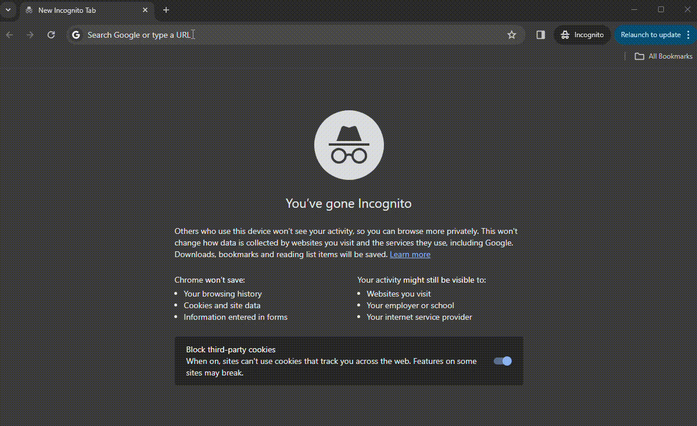

## Deployment of Argo CD
Deploying Argo CD in a Kubernetes cluster and accessing its interface involves several steps. 
Below is a simplified overview of the process. 
> **Note:_** specific details might change based on the version of Argo CD, Kubernetes, and the environment (cloud, on-premises) where you're deploying. 
Always refer to the official Argo CD documentation for the most up-to-date information.

### Step 1: Prepare Your Kubernetes Cluster

Ensure you have a Kubernetes cluster running and that `kubectl` is configured to communicate with your cluster. You can verify this by running:

```bash
kubectl cluster-info
```

If you don't see your cluster's information, you'll need to configure `kubectl` to point to your cluster.

### Step 2: Install Argo CD

Argo CD is typically installed into the `argocd` namespace. You can install it using `kubectl` by applying a manifest file from the official Argo CD repository.

1. **Create the Argo CD namespace:**

```bash
kubectl create namespace argocd
```

2. **Install Argo CD:**

```bash
kubectl apply -n argocd -f https://raw.githubusercontent.com/argoproj/argo-cd/stable/manifests/install.yaml
```

### Step 3: Access the Argo CD API Server

By default, the Argo CD API server is not exposed publicly. There are multiple ways to access it, but a common method for quick access is port-forwarding.

1. **Port-forwarding:**

```bash
kubectl port-forward svc/argocd-server -n argocd 8080:443
```

This command forwards the local port `8080` to the Argo CD server's port `443`, allowing you to access the Argo CD API server at `https://localhost:8080` through your web browser. Note that the connection is secure (HTTPS), and your browser might warn you about an untrusted certificate.

### Step 4: Login to Argo CD

1. **Get the initial admin password:**

The initial password for the `admin` account is auto-generated and stored as a secret in the Kubernetes cluster.

```bash
kubectl get pods -n argocd -l app.kubernetes.io/name=argocd-server -o name | cut -d'/' -f 2
```

2. **Login using the CLI:**

First, make sure you have the Argo CD CLI installed. Then, you can login using:

```bash
argocd login localhost:8080 --username admin --password <initial_admin_password>
```

Replace `<initial_admin_password>` with the password you retrieved in the previous step.

### Step 5: Access the Argo CD Web UI

With port-forwarding still running, open a web browser and navigate to `https://localhost:8080`. Log in using the username `admin` and the password you obtained earlier.

### Step 6: Get the Default Admin  Password
For security, it's strongly recommended to change the default admin password immediately. You can do this via the Argo CD UI under the user settings or via the CLI:

```bash
kubectl get secrets argocd-initial-admin-secret  -o jsonpath={.data.password} | base64 -d

```

### Step 7: Login to Argocd UI and chanhe password.



### Additional Steps

- **Deploy Applications:** You can now start deploying applications using Argo CD. This typically involves creating Application resources that point to your Git repositories where your Kubernetes manifests are stored.
- **Configure Access Control:** Consider configuring additional user accounts, roles, and permissions as needed for your organization.

>Remember to check the official [Argo CD documentation](https://argo-cd.readthedocs.io/) for the latest features, configurations, and best practices.


## Acknowledge
The above text was produced with the assistance of OpenAI's language model, ChatGPT.
